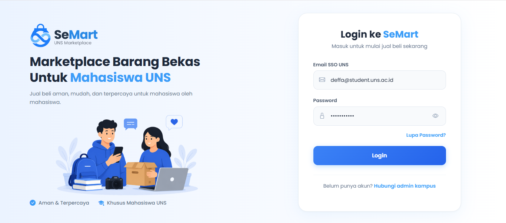
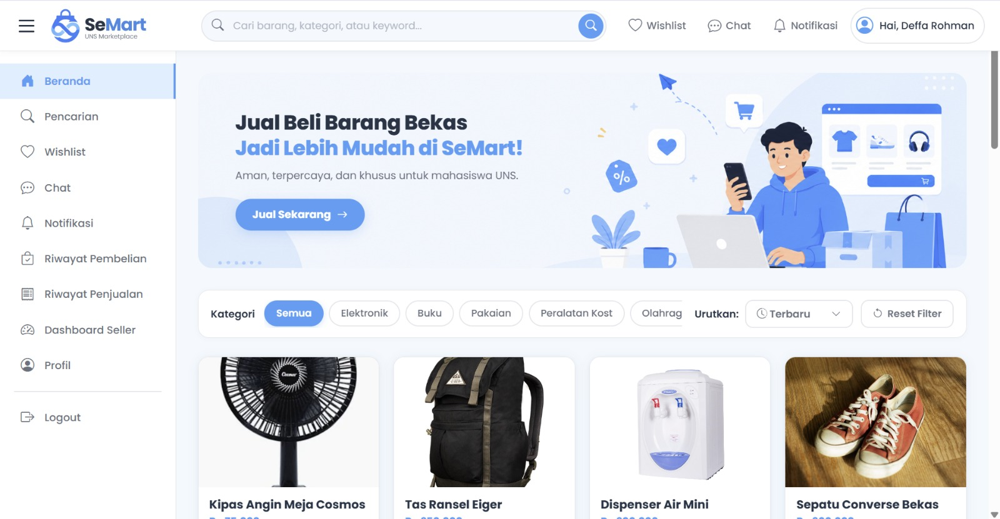
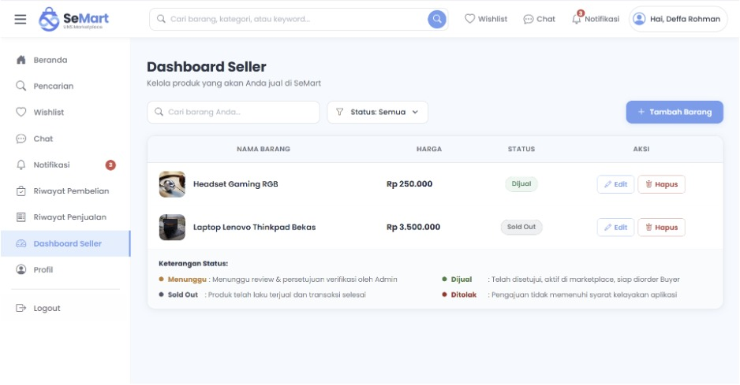
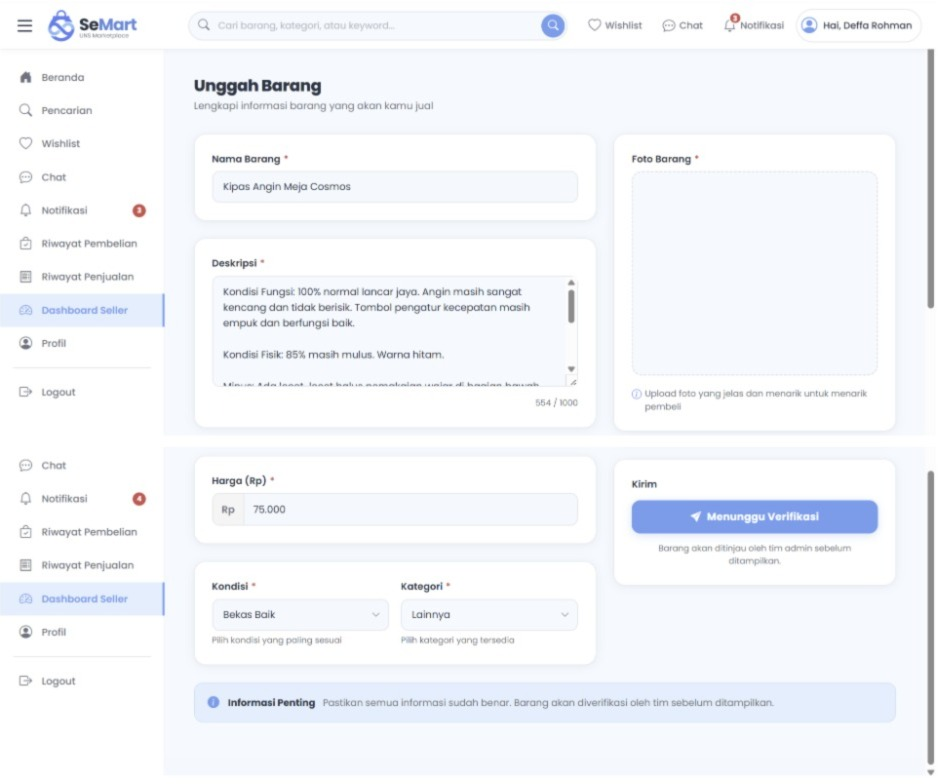
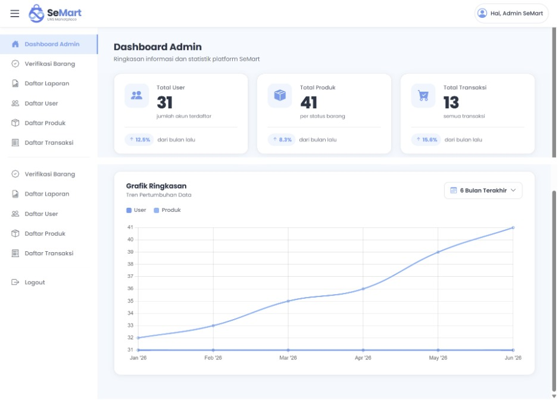
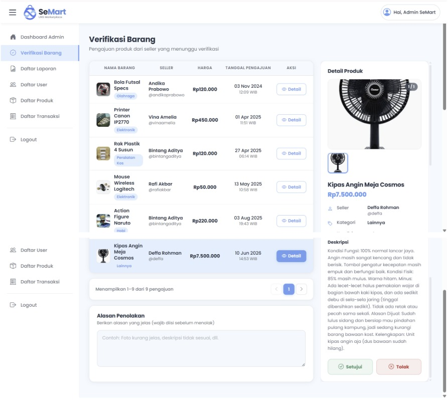

# SeMart 🛒
Aplikasi marketplace barang bekas untuk mahasiswa Universitas Sebelas Maret sebagai sarana menjual dan membeli barang bekas dengan mudah dan aman. SeMart dirancang khusus untuk ekosistem kampus, sehingga hanya mahasiswa terverifikasi yang dapat bertransaksi. Dengan SeMart, mahasiswa bisa mendapatkan barang kebutuhan dengan harga lebih terjangkau sekaligus mengurangi limbah dengan memanfaatkan barang yang masih layak pakai.

## Anggota Kelompok
| Nama | NIM | Role                                         |
|------|-----|----------------------------------------------|
| Nurul Janati Ramadhani | L0124029 | Database Admin        |
| Syifa Qurrota Salsabila | L0124032 | Frontend Developer   |
| Deffa Rohman Wicaksono | L0124144 | Backend Developer     |
| Kemal Amangylyjow | L0124021 | Frontend Support + Testing |

## Fitur Utama
1. **Upload Barang** — Seller dapat mengunggah foto, deskripsi, harga, dan kondisi barang bekas dengan mudah
2. **Penelusuran Barang Bekas** — Buyer dapat mencari barang bekas yang dibutuhkan 
3. **Chat dengan Seller** — Fitur pesan langsung antara seller dan buyer untuk negosiasi dan konfirmasi transaksi
4. **Tutup Penjualan** — Seller menetapkan status sold out setelah mencapai kesepakatan pembelian dengan buyer


## Daftar Fitur yang Telah Diimplementasi

### Fitur Buyer

- Login menggunakan SSO UNS
- Mencari barang berdasarkan kata kunci
- Filter dan sorting barang
- Melihat detail barang
- Menyimpan barang ke wishlist
- Chat dengan seller
- Checkout dan pembayaran
- Memberikan rating dan ulasan
- Melaporkan barang mencurigakan

### Fitur Seller 

- Mengunggah barang bekas
- Mengedit informasi barang
- Menghapus barang
- Mengirim link pembelian kepada buyer
- Mengubah status barang menjadi Sold Out

### Fitur Admin 

- Verifikasi barang yang diunggah seller
- Monitoring aktivitas marketplace
- Meninjau laporan pengguna
- Menindaklanjuti laporan barang
—

## Tech Stack

### Frontend
- **Blade Templating** — Template engine bawaan Laravel
- **Tailwind CSS** — Styling dan desain responsif
- **JavaScript** — Interaktivitas pada sisi klien

### Backend
- **Laravel (PHP)** — Framework utama aplikasi web
- **Laravel Sanctum** — Autentikasi berbasis token
- **Laravel Reverb** — WebSocket server untuk fitur chat realtime

### Database
- **MySQL** — Penyimpanan data utama (pengguna, produk, transaksi)
- **Eloquent ORM** — Query database dan manajemen relasi bawaan Laravel

### Tools & Infrastruktur
- **Git & GitHub** — Version control dan kolaborasi
- **Postman** — Testing API endpoint
- **VS Code** — Code editor utama
- **Composer** — Package manager PHP

---

## Cara Instalasi & Menjalankan Proyek

### Prasyarat
Pastikan sudah terinstal:
- [PHP](https://www.php.net/) v8.1 ke atas
- [Composer](https://getcomposer.org/)
- [MySQL](https://www.mysql.com/) v8 ke atas
- [Git](https://git-scm.com/)

### 1. Clone Repository

```bash
git clone https://github.com/deffarohmanwicaksono/praktikum-rpl-B-4.git
cd praktikum-rpl-B-4
git checkout dev
```

### 2. Install Dependensi

```bash
composer install
npm install
```

### 3. Konfigurasi Environment

Salin file `.env.example` menjadi `.env`:

```bash
cp .env.example .env
```

Lalu edit file `.env` dan sesuaikan konfigurasi database, mail, dan lainnya sesuai environment lokal masing-masing.

### 4. Generate Key & Migrasi Database

```bash
php artisan key:generate
php artisan migrate
php artisan db:seed   # (opsional) untuk data awal
```

### 5. Build Asset Frontend

```bash
npm run dev
```

### 6. Jalankan Server

```bash
php artisan serve
```

### 7. Jalankan Reverb (Realtime Chat)

Buka terminal baru dan jalankan:

```bash
php artisan reverb:start
```

> Reverb harus berjalan bersamaan dengan server agar fitur chat bisa berfungsi secara realtime.

### 8. Akses Aplikasi

Buka browser dan kunjungi:
```
http://localhost:8000
```

---

## Struktur Proyek

```
praktikum-rpl-B-4/
├── app/
│   ├── Http/
│   │   ├── Controllers/
│   │   └── Middleware/
│   └── Models/
├── database/
│   ├── migrations/
│   └── seeders/
├── resources/
│   ├── views/          # Blade templates
│   ├── css/
│   └── js/
├── routes/
│   ├── web.php
│   └── api.php
├── public/
├── .env.example
└── README.md
```

---

##  Screenshot MVP

### Halaman Login


### Halaman Beranda


### Halaman Dashboard Seller


### Halaman Upload Barang


### Halaman Dashoard Admin


### Halaman Verifikasi Barang



---

## Lisensi

Proyek ini dibuat untuk keperluan akademik. Hak cipta © 2026 Kelompok B-4 RPL UNS.


